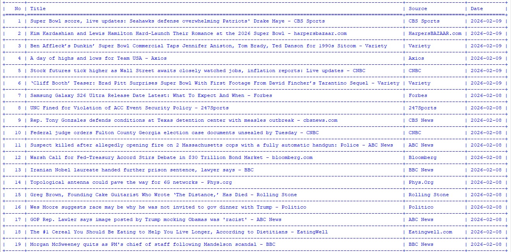

# 📰 News Aggregator CLI
A Python-based Command Line News Aggregator that fetches real-time headlines from multiple sources using NewsAPI, supports filtering, deduplication, and exporting results to JSON/CSV/Excel.
---
Internship Task Week - 4
It demonstrates API integration, CLI design, data processing, file automation, and secure environment handling.
---
## Features
- Fetch latest headlines using NewsAPI  
- Keyword-based search  
- Filter by source  
- Filter by date  
- Remove duplicate articles  
- Save results to JSON  
- Export to CSV  
- Export to Excel (.xlsx)  
- CLI arguments using argparse  
- Logging of fetch activity  
- Clean table display using tabulate  
---
## Technologies Used
- Python 3
- requests
- argparse
- python-dotenv
- openpyxl
- tabulate
- logging
- JSON / CSV handling
---
## Sample Output
# News Output

---
## Security & Private Practices
This project follows basic security best practices:
- Uses environment variables (.env) for storing API keys
- No credentials hardcoded in source code
- .env excluded via .gitignore
- Logs and generated data files not committed
- Sensitive information removed/blurred from screenshots

Note: Always protect your API keys and never upload them to public repositories.
---
## Author
Safa Fatima

2nd Year CSE Student
---
Internship Task Submission 
## 📂 Project Structure

